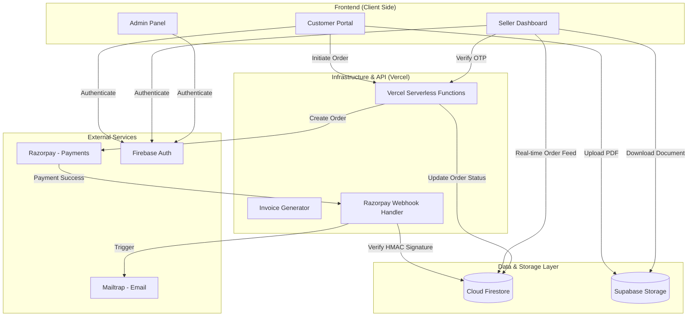

# QuickXerox - Complete Project Documentation

## 📋 Table of Contents

1. [Project Overview](#project-overview)
2. [Technology Stack](#technology-stack)
3. [Architecture](#architecture)
4. [Features](#features)
5. [Database Schema](#database-schema)
6. [Authentication & Authorization](#authentication--authorization)
7. [Payment Integration](#payment-integration)
8. [File Storage](#file-storage)
9. [Project Structure](#project-structure)
10. [Setup Instructions](#setup-instructions)
11. [Deployment](#deployment)
12. [API Endpoints](#api-endpoints)
13. [Key Implementations](#key-implementations)
14. [Mobile Responsiveness](#mobile-responsiveness)
15. [Security](#security)
16. [Cost Analysis](#cost-analysis)

---

## 📖 Project Overview

**QuickXerox** is a full-stack, "Security-First" print-on-demand platform that connects customers with local print shops. It solves the problem of long queues and data privacy by providing a contactless, pre-paid, and OTP-verified workflow.

**Key Highlights:**
- **Zero-Trust Pricing**: Server-side price recalculation prevents client-side tampering.
- **Webhook Integrity**: HMAC-SHA256 signature verification for all payment events.
- **Real-time Synchronization**: Instant order feeds via Firestore `onSnapshot`.
- **Privacy-Centric Storage**: Files stored in private Supabase buckets with time-limited signed URLs.
- **Transactional Invoicing**: Automated PDF invoice delivery via Mailtrap.
- **Mobile-Responsive PWA**: Fully optimized for mobile collection and management.

**Live URLs:**
- **Frontend**: `https://quickxerox.web.app`
- **Backend API**: `https://quickxerox-api.vercel.app`

---

---

## 🛠 Technology Stack

### Frontend
- **Framework:** React 18.2.0 with TypeScript 5.0.2
- **Build Tool:** Vite 4.5.14
- **Routing:** React Router DOM 6.18.0
- **State Management:** React Hooks (useState, useEffect, useContext)
- **Styling:** Tailwind CSS 3.3.5
- **UI Components:** Custom components with Lucide React icons
- **Forms:** Custom form handling with validation
- **Maps:** Leaflet 1.9.4 for shop location display
- **Notifications:** React Hot Toast 2.4.1
- **Date/Time:** date-fns 2.30.0

### Backend & API
- **Compute:** Vercel Serverless Functions (Node.js 20+)
- **Authentication:** Firebase Authentication
- **Database:** Google Cloud Firestore (NoSQL)
- **File Storage:** Supabase Storage (Private Buckets)
- **Email:** Mailtrap (Transactional SMTP)
- **Payments:** Razorpay (API + HMAC Webhooks)

### Hosting & Infrastructure
- **Frontend:** Firebase Hosting
- **API/Backend:** Vercel
- **Database/Auth:** Google Cloud Platform (GCP)
- **Storage:** Supabase (PostgreSQL-backed storage)
- **Version Control:** GitHub with Automated CI/CD

### Development Tools
- **Package Manager:** npm
- **Linting:** ESLint
- **Code Formatting:** Prettier (implicit via ESLint)
- **TypeScript:** For type safety

---

## 🏗 Architecture

### System Architecture



### Data Flow (A-Z Role Workflows)

#### 1. The Customer Journey
- **Upload**: Files are uploaded to private Supabase buckets.
- **Pay**: The system uses **Server-Side Price Recalculation** (ignoring client inputs) to generate a Razorpay order.
- **Track**: After payment, a 4-digit OTP is generated.
- **Collect**: The customer visits the shop and presents the OTP.

#### 2. The Seller Experience
- **Real-time Feed**: Orders appear instantly on the dashboard via Firestore listeners.
- **Download**: Documents are accessed via **60-second Signed URLs** for maximum privacy.
- **Fulfillment**: The seller verifies the customer's OTP to release the print job.

#### 3. The Admin Controls
- **Onboarding**: Admins invite sellers and approve shop statuses.
- **Financials**: Direct integration with the **Razorpay Refund API** for dispute resolution.
- **Global Control**: Toggle "Maintenance Mode" across the platform from a single dashboard.

---

## ✨ Features

### Customer Features
- ✅ File upload (PDF, images, documents)
- ✅ View nearby print shops on map
- ✅ Configure print settings (copies, color, binding, size)
- ✅ Cart management
- ✅ Razorpay payment integration
- ✅ Order tracking with real-time status
- ✅ Order history
- ✅ Mobile-responsive interface
- ✅ OTP-based pickup verification

### Seller Features
- ✅ Dashboard with daily stats (orders, revenue)
- ✅ Order management (pending, processing, completed)
- ✅ OTP generation for secure pickups
- ✅ File download (with Supabase signed URLs for security)
- ✅ Revenue reports with charts
- ✅ Shop settings (hours, location, services)
- ✅ Order status updates
- ✅ Real-time order notifications
- ✅ Mobile-optimized dashboard

### Admin Features
- ✅ Seller management (view, approve, reject)
- ✅ Order overview across all shops
- ✅ Customer management
- ✅ Analytics dashboard
- ✅ Audit logs
- ✅ System settings configuration
- ✅ CSV export functionality
- ✅ Dark mode toggle

### Technical Features
- ✅ Progressive Web App (PWA) - installable
- ✅ Offline support (service workers)
- ✅ Real-time data synchronization
- ✅ Webhook-based payment processing
- ✅ Secure file storage with signed URLs
- ✅ Mobile-first responsive design
- ✅ 12-hour time format with AM/PM
- ✅ Comprehensive error handling
- ✅ Loading states and feedback

---

## 🗄 Database Schema

### Firestore Collections

#### `users`
```javascript
{
  id: string,              // Firebase UID
  name: string,
  email: string,
  mobile?: string,
  address?: string,
  city?: string,
  state?: string,
  pincode?: string,
  role: 'customer' | 'seller' | 'admin',
  isActive: boolean,
  createdAt: Timestamp,
  updatedAt: Timestamp,
  lastLogin?: Timestamp
}
```

#### `shopOwners`
```javascript
{
  id: string,              // Firebase UID
  name?: string,           // Owner name
  email: string,
  mobile?: string,
  shopName?: string,
  status: 'pending' | 'approved' | 'active' | 'rejected',
  createdAt: Timestamp,
  settings: {
    shop: {
      name: string,
      email: string,
      phone: string,
      address: string,
      city: string,
      state: string,
      pincode: string,
      ownerName: string,
      description?: string,
      logo?: string,
      location?: {
        lat: number,
        lng: number
      },
      hours?: {
        monday: { open: string, close: string },
        // ... other days
      },
      services?: {
        blackAndWhite: boolean,
        color: boolean,
        binding: boolean,
        lamination: boolean
      }
    },
    notifications: {
      email: boolean,
      sms: boolean
    },
    preferences: {
      autoAcceptOrders: boolean,
      darkMode: boolean
    }
  }
}
```

#### `orders`
```javascript
{
  id: string,                    // Auto-generated
  customerId: string,            // User UID
  customerName: string,
  customerEmail: string,
  customerMobile: string,
  shopId: string,                // Shop owner UID
  shopName: string,
  files: Array<{
    name: string,
    url: string,                 // Public URL (deprecated)
    filePath: string,            // Supabase storage path
    size: number,
    type: string
  }>,
  printSettings: {
    copies: number,
    colorMode: 'bw' | 'color',
    paperSize: 'A4' | 'A3' | 'Letter',
    binding?: boolean,
    pages?: string
  },
  total: number,
  status: 'pending' | 'processing' | 'completed' | 'rejected',
  paymentStatus: 'pending' | 'success' | 'failed',
  paymentId?: string,            // Razorpay payment ID
  razorpayOrderId?: string,      // Razorpay order ID
  razorpayPaymentId?: string,
  razorpaySignature?: string,
  timestamp: string,             // ISO string
  completedAt?: string,
  otp?: string,                  // 6-digit pickup OTP
  notes?: string
}
```

#### `admins`
```javascript
{
  id: string,              // Firebase UID
  email: string,
  role: 'admin',
  createdAt: Timestamp,
  lastLogin?: Timestamp
}
```

#### `auditLogs`
```javascript
{
  id: string,              // Auto-generated
  timestamp: string,       // ISO string
  adminEmail: string,
  action: string,          // e.g., "seller_approved", "order_updated"
  details: string,         // JSON string with additional info
  userId?: string,
  entityType?: 'order' | 'seller' | 'customer',
  entityId?: string
}
```

#### `systemSettings` (single document)
```javascript
{
  branding: {
    appName: string
  },
  auth: {
    requireEmailVerification: boolean,
    sessionTimeoutMinutes: number,
    // ... other auth settings
  },
  payments: {
    defaultGateway: 'razorpay' | 'none',
    platformFeePercent: number
  },
  // ... other settings
}
```

---

## 🔐 Authentication & Authorization

### Firebase Authentication

**Authentication Methods:**
- Email/Password authentication
- Custom role-based access control (RBAC)

**User Roles:**
1. **Customer** - Can place orders, view order history
2. **Seller** - Can manage their shop and orders
3. **Admin** - Full platform access

**Implementation:**
```javascript
// Login
const userCredential = await signInWithEmailAndPassword(auth, email, password);

// Check role
const userDoc = await getDoc(doc(db, 'users', uid));
const role = userDoc.data().role;

// Route protection
useEffect(() => {
  if (!currentUser || role !== 'admin') {
    navigate('/login');
  }
}, [currentUser, role]);
```

**Protected Routes:**
- `/customer/*` - Requires customer role
- `/seller/*` - Requires seller role
- `/admin/*` - Requires admin role

---

## 💳 Payment Integration

### Razorpay Setup

**Configuration:**
```javascript
// Frontend - RazorpayKey
const RAZORPAY_KEY_ID = "rzp_test_..."  // Test mode

// Backend - Webhook Secret
const RAZORPAY_WEBHOOK_SECRET = "test_webhook_secret_temporary_12345"
```

**Payment Flow:**

1. **Create Razorpay Order (Frontend):**
```javascript
const options = {
  key: RAZORPAY_KEY_ID,
  amount: total * 100,  // Amount in paise
  currency: "INR",
  name: "QuickXerox",
  description: "Print Order Payment",
  order_id: razorpayOrderId,
  handler: async (response) => {
    // Payment success
    updateOrderInFirestore(orderId, {
      paymentStatus: 'success',
      razorpayPaymentId: response.razorpay_payment_id
    });
  }
};
```

2. **Webhook Processing (Vercel API):**
```javascript
// vercel-api/api/razorpay-webhook.ts
const signature = req.headers['x-razorpay-signature'];
const body = JSON.stringify(req.body);

// Verify HMAC SHA256 signature
const expectedSignature = crypto
  .createHmac('sha256', process.env.RAZORPAY_WEBHOOK_SECRET)
  .update(body)
  .digest('hex');

if (signature !== expectedSignature) {
  throw new Error('Invalid signature');
}

// Atomic update in Firestore
const orderId = req.body.payload.payment.entity.order_id;
await db.collection('orders').doc(orderId).update({
  paymentStatus: 'success',
  status: 'processing',
  otp: generateOTP() // 4-digit code
});
```

**Razorpay Dashboard Configuration:**
- Webhook URL: `https://quickxerox-api.vercel.app/api/razorpay-webhook`
- Events: `order.paid`, `payment.captured`
- Status: Enabled

---

## 📁 File Storage

### Supabase Storage Setup

**Bucket Configuration:**
- Bucket name: `quickxerox-files` (or similar)
- Public access: Disabled (secure)
- File size limit: 10MB per file

**Upload Implementation:**
```javascript
import { supabase } from './supabaseClient';

const uploadFile = async (file) => {
  const fileName = `${Date.now()}_${file.name}`;
  const filePath = `uploads/${fileName}`;
  
  const { data, error } = await supabase.storage
    .from('quickxerox-files')
    .upload(filePath, file);
  
  if (error) throw error;
  return filePath;  // Store this in Firestore
};
```

**Secure Download (Signed URLs):**
```javascript
const getSignedUrl = async (filePath) => {
  const { data, error } = await supabase.storage
    .from('quickxerox-files')
    .createSignedUrl(filePath, 3600);  // Valid for 1 hour
  
  if (error) throw error;
  return data.signedUrl;
};
```

**Auto-cleanup:**
Files from completed orders are automatically deleted after 24 hours to save storage.

---

## 📂 Project Structure

```
QuickXerox/
├── public/
│   ├── manifest.json           # PWA manifest
│   └── service-worker.js       # Service worker for offline support
│
├── src/
│   ├── components/
│   │   ├── account/
│   │   │   └── OrderHistory.tsx
│   │   ├── admin/
│   │   │   └── AnalyticsDashboard.tsx
│   │   ├── cart/
│   │   │   └── Cart.tsx
│   │   ├── checkout/
│   │   │   └── PaymentButton.tsx
│   │   ├── notifications/
│   │   │   └── NotificationCenter.tsx
│   │   ├── orders/
│   │   │   └── OrderTracking.tsx
│   │   ├── seller/
│   │   │   ├── OrderList.tsx
│   │   │   ├── OrderStats.tsx
│   │   │   ├── RevenueReports.tsx
│   │   │   └── TodayOrders.tsx
│   │   └── shops/
│   │       ├── ShopCard.tsx
│   │       └── ShopMap.tsx
│   │
│   ├── contexts/
│   │   ├── AuthContext.tsx     # Authentication state
│   │   └── CartContext.tsx     # Shopping cart state
│   │
│   ├── pages/
│   │   ├── AdminDashboard.tsx
│   │   ├── AdminSellerList.tsx
│   │   ├── AdminSellerDetails.tsx
│   │   ├── CustomerDashboard.tsx
│   │   ├── HomePage.tsx
│   │   ├── LoginPage.tsx
│   │   ├── SellerDashboard.tsx
│   │   └── SellerLoginPage.tsx
│   │
│   ├── services/
│   │   ├── storageService.ts   # Supabase file operations
│   │   └── orderService.ts     # Order CRUD operations
│   │
│   ├── types/
│   │   └── index.ts            # TypeScript interfaces
│   │
│   ├── firebase.ts             # Firebase config
│   ├── supabaseClient.ts       # Supabase config
│   ├── App.tsx                 # Main app component
│   ├── main.tsx                # Entry point
│   └── index.css               # Global styles
│
├── vercel-api/                 # Vercel Serverless Functions (Backend)
│   ├── index.js                # Express server
│   ├── package.json
│   └── serviceAccountKey.json  # Firebase admin credentials (not in git)
│
├── .firebase/                  # Firebase cache
├── dist/                       # Build output
├── .gitignore
├── eslint.config.js
├── firebase.json               # Firebase hosting config
├── index.html
├── package.json
├── postcss.config.js
├── tailwind.config.js
├── tsconfig.json
├── vite.config.ts
└── README.md
```

---

## 🚀 Setup Instructions

### Prerequisites
- Node.js 18+ and npm
- Firebase account
- Supabase account
- Razorpay account (test mode)
- Vercel account (for serverless backend)
- GitHub account

### Step 1: Clone Repository
```bash
git clone https://github.com/hemanthreddykoduru/QuickXerox.git
cd QuickXerox
npm install
```

### Step 2: Firebase Setup

1. **Create Firebase Project:**
   - Go to https://console.firebase.google.com/
   - Create new project: "QuickXerox"
   - Enable Google Analytics (optional)

2. **Enable Authentication:**
   - Authentication → Get Started
   - Sign-in method → Email/Password → Enable

3. **Create Firestore Database:**
   - Firestore Database → Create Database
   - Start in production mode
   - Choose location (e.g., `us-central`)

4. **Get Firebase Config:**
   - Project Settings → General → Your apps
   - Add web app
   - Copy configuration

5. **Create `src/firebase.ts`:**
```typescript
import { initializeApp } from 'firebase/app';
import { getAuth } from 'firebase/auth';
import { getFirestore } from 'firebase/firestore';

const firebaseConfig = {
  apiKey: "YOUR_API_KEY",
  authDomain: "YOUR_PROJECT.firebaseapp.com",
  projectId: "YOUR_PROJECT_ID",
  storageBucket: "YOUR_PROJECT.appspot.com",
  messagingSenderId: "YOUR_SENDER_ID",
  appId: "YOUR_APP_ID"
};

const app = initializeApp(firebaseConfig);
export const auth = getAuth(app);
export const db = getFirestore(app);
```

6. **Download Service Account Key:**
   - Project Settings → Service Accounts
   - Generate new private key
   - Save as `server/serviceAccountKey.json`

### Step 3: Supabase Setup

1. **Create Supabase Project:**
   - Go to https://supabase.com/
   - New project → Name: "QuickXerox"

2. **Create Storage Bucket:**
   - Storage → New bucket
   - Name: `quickxerox-files`
   - Public: No (keep private)

3. **Get Supabase Credentials:**
   - Project Settings → API
   - Copy `URL` and `anon/public` key

4. **Create `src/supabaseClient.ts`:**
```typescript
import { createClient } from '@supabase/supabase-js';

const supabaseUrl = 'https://YOUR_PROJECT.supabase.co';
const supabaseKey = 'YOUR_ANON_KEY';

export const supabase = createClient(supabaseUrl, supabaseKey);
```

### Step 4: Razorpay Setup

1. **Create Razorpay Account:**
   - Go to https://dashboard.razorpay.com/
   - Sign up → Verify email

2. **Get Test API Keys:**
   - Settings → API Keys
   - Generate Test Key
   - Copy `Key ID` and `Key Secret`

3. **Add to Frontend:**
```javascript
// In your payment component
const RAZORPAY_KEY_ID = "rzp_test_YOUR_KEY";
```

4. **Configure Webhook:**
   - Settings → Webhooks → Add New Webhook
   - URL: `https://YOUR_VERCEL_APP.vercel.app/api/razorpay-webhook`
   - Secret: Create a strong secret
   - Events: Select all payment events
   - Status: Active

### Step 5: Vercel Backend Setup

1. **Create Vercel Account:**
   - Go to https://vercel.com/
   - Sign up with GitHub

2. **Deploy Server:**
   - New Project → Deploy from GitHub repo
   - Select QuickXerox repo
   - Root directory: `/server`

3. **Environment Variables:**
   ```
   PORT=3001
   RAZORPAY_WEBHOOK_SECRET=your_webhook_secret
   GOOGLE_APPLICATION_CREDENTIALS_JSON={"type":"service_account",...}
   ```
   (Paste entire serviceAccountKey.json as value)

4. **Configure Networking:**
   - Settings → Networking
   - Generate Domain
   - Note the public URL

### Step 6: Run Locally

```bash
# Terminal 1 - Frontend
npm run dev

# Terminal 2 - Server (optional for local testing)
cd server
npm install
node index.js
```

Access at: `http://localhost:5173`

---

## 🌐 Deployment

### Frontend Deployment (Firebase Hosting)

1. **Install Firebase CLI:**
```bash
npm install -g firebase-tools
firebase login
```

2. **Initialize Firebase:**
```bash
firebase init hosting
# Select:
# - Use existing project
# - Public directory: dist
# - Single-page app: Yes
# - Auto build/deploy with GitHub: No
```

3. **Build and Deploy:**
```bash
npm run build
firebase deploy --only hosting
```

**Result:** Live at `https://YOUR_PROJECT.web.app`

### Backend Deployment (Vercel)

Vercel auto-deploys on every push to `main` branch!

**Manual Deploy:**
1. Push changes to GitHub
2. Vercel automatically detects and deploys (via vercel.json)
3. Monitor in Vercel dashboard

---

## 🔌 API Endpoints

### Vercel Serverless Functions

**Base URL:** `https://quickxerox-api.vercel.app`

#### 1. Payment Endpoints
- `POST /api/create-order`: Securely calculates price and creates Razorpay session.
- `POST /api/razorpay-webhook`: Securely verifies payment and updates Firestore.
- `POST /api/verify-payment`: Fallback for manual payment verification.

#### 2. Communication Endpoints
- `POST /api/send-invoice`: Generates PDF invoice and emails via Mailtrap.
- `POST /api/send-invitation`: Sends secure shop owner invitation links.
- `POST /api/send-verification`: Sends 6-digit identity verification codes.

#### 3. Administrative Endpoints
- `POST /api/razorpay-refund`: Triggers automated refunds via Razorpay API.
- `POST /api/upload-invoice`: Persists generated invoices to storage.

---

## 🔑 Key Implementations

### 1. Real-Time Order Updates

**Firestore onSnapshot:**
```typescript
useEffect(() => {
  const q = query(
    collection(db, 'orders'),
    where('shopId', '==', currentUser.uid)
  );
  
  const unsubscribe = onSnapshot(q, (snapshot) => {
    const orders = snapshot.docs.map(doc => ({
      id: doc.id,
      ...doc.data()
    }));
    setOrders(orders);
  });
  
  return () => unsubscribe();
}, [currentUser]);
```

### 2. OTP Generation and Verification

**Generate OTP:**
```typescript
const generateOTP = () => {
  const otp = Math.floor(100000 + Math.random() * 900000).toString();
  
  await updateDoc(doc(db, 'orders', orderId), {
    otp: otp,
    otpGeneratedAt: new Date().toISOString()
  });
  
  return otp;
};
```

**Verify OTP:**
```typescript
const verifyOTP = async (orderId, inputOtp) => {
  const orderDoc = await getDoc(doc(db, 'orders', orderId));
  const storedOtp = orderDoc.data().otp;
  
  if (inputOtp === storedOtp) {
    await updateDoc(doc(db, 'orders', orderId), {
      status: 'completed',
      completedAt: new Date().toISOString(),
      otp: null  // Clear OTP after use
    });
    return true;
  }
  return false;
};
```

### 3. Signed URLs for Secure File Access

```typescript
export const getSignedUrl = async (filePath: string): Promise<string> => {
  const { data, error } = await supabase.storage
    .from('quickxerox-files')
    .createSignedUrl(filePath, 3600);  // 1 hour expiry
  
  if (error) throw error;
  return data.signedUrl;
};
```

### 4. Payment Signature Verification

**Server-side (Express):**
```javascript
const crypto = require('crypto');

const verifySignature = (body, signature, secret) => {
  const expectedSignature = crypto
    .createHmac('sha256', secret)
    .update(JSON.stringify(body))
    .digest('hex');
  
  return signature === expectedSignature;
};
```

### 5. Firestore Security Rules

```javascript
rules_version = '2';
service cloud.firestore {
  match /databases/{database}/documents {
    // Users can only read/write their own data
    match /users/{userId} {
      allow read, write: if request.auth != null && request.auth.uid == userId;
    }
    
    // Only admins can access admin collection
    match /admins/{adminId} {
      allow read: if request.auth != null;
      allow write: if request.auth != null && 
        get(/databases/$(database)/documents/admins/$(request.auth.uid)).data.role == 'admin';
    }
    
    // Orders: customer can create, seller and customer can read their orders
    match /orders/{orderId} {
      allow create: if request.auth != null;
      allow read: if request.auth != null && (
        resource.data.customerId == request.auth.uid ||
        resource.data.shopId == request.auth.uid ||
        get(/databases/$(database)/documents/admins/$(request.auth.uid)).data.role == 'admin'
      );
      allow update: if request.auth != null && (
        resource.data.shopId == request.auth.uid ||
        get(/databases/$(database)/documents/admins/$(request.auth.uid)).data.role == 'admin'
      );
    }
    
    // Shop owners readable by all, writable by owner
    match /shopOwners/{shopId} {
      allow read: if request.auth != null;
      allow write: if request.auth != null && request.auth.uid == shopId;
    }
  }
}
```

---

## 📱 Mobile Responsiveness

### Breakpoints Used
```css
/* Tailwind breakpoints */
sm: 640px   /* Small devices */
md: 768px   /* Tablets */
lg: 1024px  /* Desktops */
xl: 1280px  /* Large screens */
```

### Mobile Optimizations

1. **Touch-Friendly Buttons:** Minimum 44px height
2. **Responsive Tables:** Convert to cards on mobile
3. **Hamburger Menu:** For mobile navigation
4. **Optimized Forms:** Single column layout on mobile
5. **Image Optimization:** Lazy loading and compression

**Example:**
```tsx
{/* Desktop: Table, Mobile: Cards */}
<div className="hidden md:block">
  <table>...</table>
</div>

<div className="md:hidden">
  {orders.map(order => (
    <div className="card">...</div>
  ))}
</div>
```

---

## 🔒 Security

### Implemented Security Measures

1. **Authentication:**
   - Firebase Authentication with secure password hashing
   - Role-based access control (RBAC)
   - Session management

2. **Data Protection:**
   - Firestore security rules
   - Private file storage with signed URLs
   - No sensitive data in frontend code

3. **Payment Security:**
   - Razorpay signature verification
   - Server-side payment processing
   - No direct card details handling (PCI DSS compliant via Razorpay)

4. **API Security:**
   - CORS enabled only for allowed origins
   - Webhook signature verification
   - Rate limiting (future enhancement)

5. **File Upload Security:**
   - File type validation
   - Size limits (10MB)
   - Virus scanning (recommended future enhancement)

### Environment Variables (.env)
```bash
# Never commit these!
VITE_FIREBASE_API_KEY="..."
VITE_FIREBASE_AUTH_DOMAIN="..."
VITE_SUPABASE_URL="..."
VITE_SUPABASE_KEY="..."
RAZORPAY_KEY_ID="..."
```

---

## 💰 Cost Analysis

### Monthly Costs (Free Tier)

| Service | Usage | Cost |
|---------|-------|------|
| Firebase Hosting | Frontend hosting | **$0** |
| Firebase Firestore | Database (reads/writes) | **$0** (within limits) |
| Firebase Authentication | User auth | **$0** |
| Vercel | Serverless backend | **$0** (Hobby) |
| Supabase | File storage | **$0** (within limits) |
| Razorpay | Payment gateway | Transaction fees only |
| GitHub | Version control | **$0** |

**Total Infrastructure: $0/month** ✅

### Free Tier Limits

**Firebase Firestore:**
- 50,000 reads/day
- 20,000 writes/day
- 20,000 deletes/day
- 1 GB storage

**Firebase Hosting:**
- 10 GB storage
- 360 MB/day bandwidth

**Vercel:**
- 100 GB Bandwidth/month
- 6,000 Build Minutes/month
- Unlimited Serverless Function Requests (Hobby)

**Supabase:**
- 500 MB storage
- 2 GB bandwidth

**Scaling:** For production with high traffic, upgrade to paid tiers when needed.

---

## 📝 Additional Notes

### Creating First Admin User

Run this script once to create an admin:

```javascript
// scripts/createAdmin.js
import { auth, db } from '../src/firebase';
import { createUserWithEmailAndPassword } from 'firebase/auth';
import { doc, setDoc } from 'firebase/firestore';

const createAdmin = async () => {
  const email = 'admin@quickxerox.com';
  const password = 'Admin@123';
  
  const userCredential = await createUserWithEmailAndPassword(auth, email, password);
  
  await setDoc(doc(db, 'admins', userCredential.user.uid), {
    email: email,
    role: 'admin',
    createdAt: new Date()
  });
  
  console.log('Admin created successfully!');
};

createAdmin();
```

### PWA Installation

The app can be installed on mobile devices and desktops:
1. Visit the website
2. Click "Install" prompt or
3. Browser menu → "Install QuickXerox"

### Future Enhancements

- [ ] SMS notifications via Twilio
- [ ] Email notifications via SendGrid
- [ ] Multi-language support
- [ ] Dark mode for all pages
- [ ] Advanced analytics
- [ ] Seller ratings and reviews
- [ ] Promotional codes/discounts
- [ ] Bulk order processing
- [ ] Invoice generation
- [ ] Push notifications

---

## 🤝 Contributing

To contribute:
1. Fork the repository
2. Create feature branch: `git checkout -b feature/AmazingFeature`
3. Commit changes: `git commit -m 'Add AmazingFeature'`
4. Push to branch: `git push origin feature/AmazingFeature`
5. Open Pull Request

---

## 📞 Support

For issues and questions:
- GitHub Issues: https://github.com/hemanthreddykoduru/QuickXerox/issues
- Email: hemanthreddykoduru@gmail.com (replace with actual email)

---

## 📄 License

This project is open source and available under the MIT License.

---

## 🙏 Acknowledgments

- Firebase for authentication and database
- Razorpay for payment gateway
- Vercel for free hosting and serverless functions
- Supabase for file storage
- React and Vite communities
- Tailwind CSS for styling system

---

**Last Updated:** January 25, 2026

**Version:** 1.0.0

**Author:** Hemanth Reddy Koduru

---

**Made with ❤️ in India**
